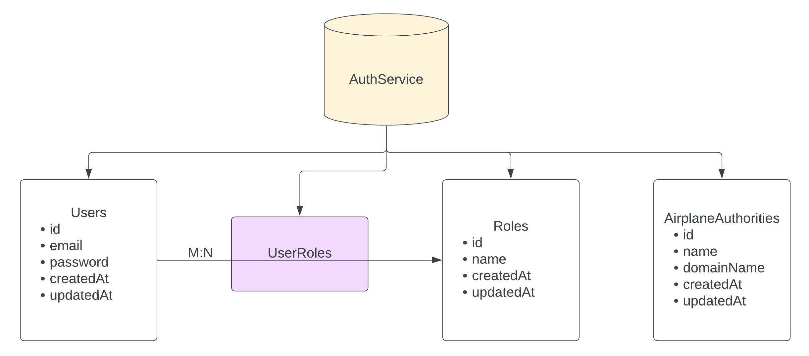

# AUTHSERVICE DOCUMENTATION

This micro-service mainly focusses on the authorization and authentication of the Users that are sending request for _signup_ and _signin_ in the following service.  

Additional Features:

- deleting an User account
- finding whether an User is admin or not

---

## DB DESIGNS

- Databases required
  - User
  - Role
  - UserRoles
  - AirplaneAuthorities

- Design of the Databases

  - **Users Table _(or User Model)_**

    - id (created by sequelize automatically)
    - email
    - password
    - createdAt (created by sequelize automatically)
    - updatedAt (created by sequelize automatically)
  
  - **Roles Table _(or Role Model)_**

    - id (created by sequelize automatically)
    - name
    - createdAt (created by sequelize automatically)
    - updatedAt (created by sequelize automatically)
  
  - **UserRoles Table** : used as a `through` - table to create _MANY-TO-MANY_ associations between tables `Users` and `Roles`.

  - **AirplaneAuthorities Table _(or AirplaneAuthority Model)_**

    - id (created by sequelize automatically)
    - name
    - domainName
    - createdAt (created by sequelize automatically)
    - updatedAt (created by sequelize automatically)



---

## APIs exposed and its corresponding URLS

[For signup](http://localhost:3002/api/v1/signup)  
Request Format (to be sent in body) (json):

```json
{
 "email": <YOUR_EMAILID>,
 "password": <YOUR_PASSWORD>
}
```

- Creates a User with the given email-id and password. The password is encrypted using the npm package [bcrypt](https://www.npmjs.com/package/bcrypt).
- As soon as the user is created it allots a role to the user based upon the _Domain-name_ in email-id. For example,
  - if the email is of the form `xxxxxx@admin.xxx` then it allots an admin role.
  - if the email is of the form `xxxxxx@<AIRPLANE_AUTHORITY>.xxx` then it allots a role of Airplane Authority.
  - for all other cases, it allots a role of customer to the user.

[For signin](http://localhost:3002/api/v1/signin)  
Request format (to be sent in body) (json):

```json
{
 "email": <YOUR_EMAILID>,
 "password": <YOUR_PASSWORD>
}
```

- On successfull signin, a token (valid for 96 hrs or 4 days) is given which the user should save for further use during flight booking or any other activities which may require it.

[For deleting an user](http://localhost:3002/api/v1/delete)  
Request format (to be sent in body) (json):

```json
{
 "email": <YOUR_EMAILID>,
 "password": <YOUR_PASSWORD>,
 "token": <YOUR_TOKEN>
}
```

- Successfull deletion resuslts in removal of allotted user role.

[For checking Admin rights](http://localhost:3002/api/v1/isAdmin)  
Request format (to be sent in body) (json):

```json
{
    "userId": <INTEGER_USERID> 
}
```

- Returns whether the corresponding user is an admin or not.
